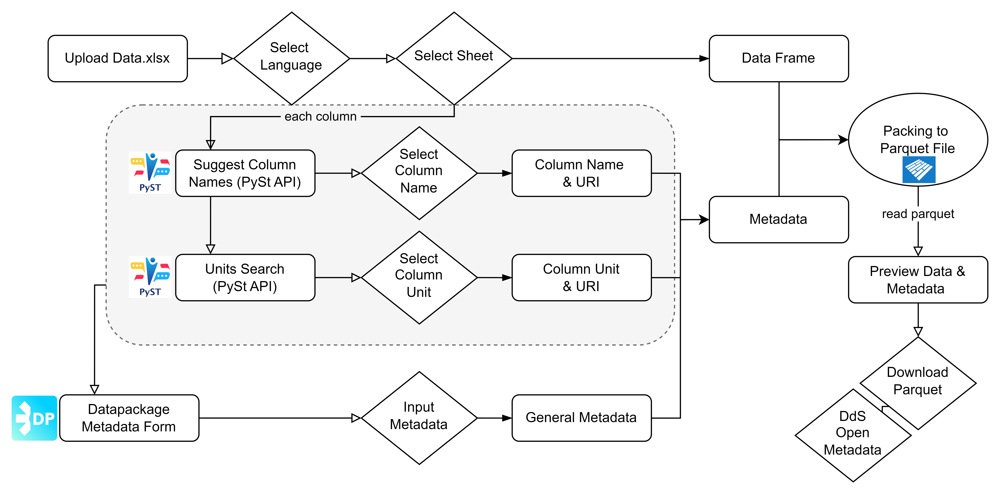

# Usage

The concept follows the flowchart:

Usage is recommended via the [web-application](https://trailpack.streamlit.app/). 
For advanced users, the moficiation directly via code is accessible by installing the repository and following the steps in the [example notebook](https://github.com/TimoDiepers/trailpack/blob/main/examples/example_packing.ipynb).

A simple example on how to use the web-application is included below. First loading a data excel file and linking the ontologies...

<video width="80%" controls>
  <source src="../uploading_and_ontology_streamlit-streamlit_app-2025-10-17-08-10-31.webm" type="video/webm">
</video>

and adding the general metadata towards generating the full parquet file.

<video width="80%" controls>
  <source src="../general_metadata_to_download_streamlit-streamlit_app-2025-10-17-08-10-00.webm" type="video/webm">
</video>
