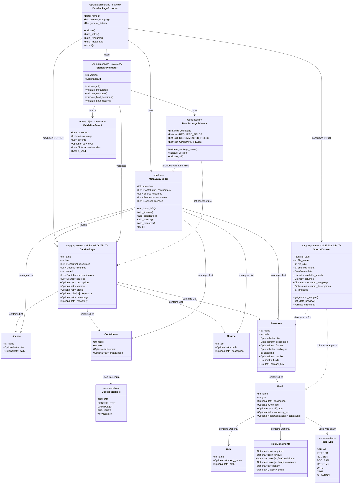

# Trailpack Domain Schema

## Frictionless Data Package - Pydantic Models

This diagram shows the relationships between Pydantic models used in the Trailpack data package system.

### ⚠️ Critical Gaps Identified

**1. Missing OUTPUT Model:** `DataPackage` (aggregate root)
- Currently, `MetaDataBuilder.build()` returns `Dict[str, Any]` instead of a typed model
- No root entity to represent the complete data package
- See [detailed analysis](#️-missing-domain-model-datapackage) below

**2. Missing INPUT Model:** `SourceDataset` / `InputData` (aggregate root)
- Currently, uploaded Excel data exists as scattered session state primitives
- No domain model representing the source data being processed
- See [detailed analysis](#️-missing-domain-model-sourcedataset) below

### 📊 The Transformation Gap

```
┌─────────────────────────────────────────────────────────────────────┐
│                    CURRENT ARCHITECTURE GAP                          │
└─────────────────────────────────────────────────────────────────────┘

INPUT (⚠️ Missing)          PROCESS (✅ Exists)         OUTPUT (⚠️ Missing)
┌──────────────────┐       ┌──────────────────┐       ┌──────────────────┐
│                  │       │                  │       │                  │
│  SourceDataset   │──────▶│ DataPackage-     │──────▶│   DataPackage    │
│  (Excel file +   │       │ Exporter         │       │   (Frictionless  │
│   mappings)      │       │                  │       │    metadata)     │
│                  │       │ Uses:            │       │                  │
│ ⚠️ MISSING       │       │ • MetaDataBuilder│       │ ⚠️ MISSING       │
│ Currently:       │       │ • Validator      │       │ Currently:       │
│ Scattered in     │       │ • Field builders │       │ Dict[str, Any]   │
│ session state    │       │                  │       │ (no model)       │
│                  │       │                  │       │                  │
└──────────────────┘       └──────────────────┘       └──────────────────┘
```

**Impact:** Without these aggregate roots, we have:
- ❌ No type safety for input or output
- ❌ No clear domain boundaries
- ❌ UI layer directly manipulates data
- ❌ Difficult to test in isolation
- ❌ Cannot reuse in CLI/API contexts



## Model Hierarchy

### Level 0: Input Aggregate Root (Source Data)
- **`SourceDataset` (aggregate root - ⚠️ MISSING INPUT)** - Represents uploaded Excel file
  - Contains: uploaded file, DataFrame, sheet selection, column mappings
  - Currently scattered across Streamlit session state
  - This is the INPUT to the transformation process

### Level 1: Primitive Models (No Dependencies)
- `License` - License information
- `Source` - Data source information
- `Unit` - Measurement units
- `FieldConstraints` - Validation constraints
- `FieldType` (enum) - Field type enumeration
- `ContributorRole` (enum) - Contributor role enumeration

### Level 2: Composite Models (Depend on Level 1)
- `Contributor` - Uses `ContributorRole` enum
- `Field` - Contains `Unit`, `FieldConstraints`, uses `FieldType`

### Level 3: Resource Models (Depend on Level 2)
- `Resource` - Contains list of `Field` objects

### Level 4: Output Aggregate Root (Product)
- **`DataPackage` (aggregate root - ⚠️ MISSING OUTPUT)** - Root entity containing all metadata
  - Contains: `List[Resource]`, `List[License]`, `List[Contributor]`, `List[Source]`
  - Required fields: `name`, `title`, `resources`, `licenses`, `created`, `contributors`, `sources`
  - This should be a Pydantic model but currently only exists as `Dict[str, Any]`
  - This is the OUTPUT of the transformation process

### Level 5: Builder & Specification (Depend on Level 1-4)
- `MetaDataBuilder` (builder) - Constructs `DataPackage` step-by-step with fluent API
  - **Current issue:** `.build()` returns `Dict[str, Any]` instead of `DataPackage` model
- `DataPackageSchema` (specification) - Defines validation rules and field specifications

### Level 6: Domain Services & Transient Objects (Orchestrate Levels 1-5)
- `StandardValidator` (domain service - **stateless**) - Validates `DataPackage` and entities
- `DataPackageExporter` (application service - **stateful**) - Creates `DataPackage` via `MetaDataBuilder`
- `ValidationResult` (value object - **transient, not persisted**) - Immutable validation result container

## Key Relationships

### Entity Relationships
| Parent Model | Child Model | Relationship Type | Cardinality |
|--------------|-------------|-------------------|-------------|
| `DataPackage` ⚠️ | `Resource` | composition | 1..* |
| `DataPackage` ⚠️ | `License` | composition | 1..* |
| `DataPackage` ⚠️ | `Contributor` | composition | 1..* |
| `DataPackage` ⚠️ | `Source` | composition | 1..* |
| `Resource` | `Field` | composition | 0..* |
| `Field` | `Unit` | composition | 0..1 |
| `Field` | `FieldConstraints` | composition | 0..1 |
| `Field` | `FieldType` | reference | 1 |
| `Contributor` | `ContributorRole` | reference | 1 |

### Builder Relationships
| Builder | Managed/Built Model | Relationship Type | Cardinality |
|---------|---------------------|-------------------|-------------|
| `MetaDataBuilder` | `DataPackage` ⚠️ | builds | 1 |
| `MetaDataBuilder` | `License` | aggregates | 0..* |
| `MetaDataBuilder` | `Contributor` | aggregates | 0..* |
| `MetaDataBuilder` | `Source` | aggregates | 0..* |
| `MetaDataBuilder` | `Resource` | aggregates | 0..* |

**⚠️ Current Issue:** `.build()` returns `Dict[str, Any]` instead of `DataPackage` model

### Service Relationships

**Domain Service (Stateless)**
| Service | Used Model/Service | Relationship Type | Purpose |
|---------|-------------------|-------------------|---------|
| `StandardValidator` | `DataPackage` ⚠️ | validates | Validates complete package |
| `StandardValidator` | `DataPackageSchema` | dependency | Gets validation rules |
| `StandardValidator` | `ValidationResult` | creates (transient) | Returns validation status |

**Application Service (Stateful - Orchestrator)**
| Service | Used Model/Service | Relationship Type | Purpose |
|---------|-------------------|-------------------|---------|
| `DataPackageExporter` | `SourceDataset` ⚠️ | consumes (INPUT) | Reads source data and mappings |
| `DataPackageExporter` | `DataPackage` ⚠️ | produces (OUTPUT) | Builds via MetaDataBuilder |
| `DataPackageExporter` | `MetaDataBuilder` | uses | Constructs metadata |
| `DataPackageExporter` | `StandardValidator` | uses | Validates package |
| `DataPackageExporter` | `Field` | creates | Builds field definitions from source columns |
| `DataPackageExporter` | `Resource` | creates | Builds resource definition from source data |

## Model Locations

### Entity Models
**File:** `trailpack/packing/datapackage_schema.py`
- Enums: Lines 15-35 (`FieldType`, `ContributorRole`)
- Primitive Models: Lines 38-163 (`License`, `Contributor`, `Source`, `Unit`, `FieldConstraints`)
- Composite Models: Lines 165-210 (`Field`)
- Resource Models: Lines 213-270 (`Resource`)
- Builder: Lines 435-593 (`MetaDataBuilder`)
- Specification: Lines 273-433 (`DataPackageSchema`)

### Services & Transient Objects

**Domain Services (Stateless)**
- **File:** `trailpack/validation/standard_validator.py`
  - `StandardValidator`: Line 203 - Pure domain validation logic

**Application Services (Stateful, Not Persisted)**
- **File:** `trailpack/packing/export_service.py`
  - `DataPackageExporter`: Line 21 - Orchestrates export use case

**Transient Objects (Not Persisted)**
- **File:** `trailpack/validation/standard_validator.py`
  - `ValidationResult`: Line 20 - Validation result container (in-memory only)

## Architectural Patterns

### DDD Pattern Classification

**Entities (Pydantic Models)**
- Represent core domain concepts with identity
- Immutable after validation
- Examples: `Field`, `Resource`, `License`, `Contributor`
- **⚠️ Missing:** `DataPackage` - OUTPUT aggregate root containing all entities
- **⚠️ Missing:** `SourceDataset` - INPUT aggregate root containing source data

**Value Objects**
- Immutable objects defined by their attributes
- Examples: `Unit`, `FieldConstraints`, `ValidationResult`

**Enumerations**
- Constrained value sets
- Examples: `FieldType`, `ContributorRole`

**Builder Pattern**
- `MetaDataBuilder` - Constructs complex metadata step-by-step
- Fluent API for better UX
- Validates incrementally during construction

**Specification Pattern**
- `DataPackageSchema` - Defines validation rules and constraints
- Separates validation logic from entities
- Provides UI field definitions

**Domain Services (Stateless)**
- `StandardValidator` - Pure domain service
  - Stateless validation logic
  - No internal state between calls
  - Validates entities against specifications
  - Returns transient `ValidationResult` objects

**Application Services (Stateful)**
- `DataPackageExporter` - Orchestration/Use Case handler
  - Maintains context (DataFrame, mappings, metadata)
  - Coordinates operations across multiple entities
  - Uses domain services (`StandardValidator`, `MetaDataBuilder`)
  - Not persisted - exists only during export workflow

**Transient Objects (Not Persisted)**
- `ValidationResult` - Exists only in memory during validation
- `MetaDataBuilder` - Temporary builder discarded after `.build()`
- These objects are never saved to database/storage

## Persistence & State Summary

### ✅ Persisted to Parquet (Long-term Storage)
- `Field`, `Resource`, `License`, `Contributor`, `Source`, `Unit` → Embedded as JSON metadata
- `DataFrame` → Stored as columnar data
- Final output: Single `.parquet` file with data + metadata

### ❌ Not Persisted (Transient/In-Memory Only)
- `SourceDataset` ⚠️ → INPUT aggregate, exists only during processing (UI session state)
- `ValidationResult` → Validation feedback, discarded after use
- `MetaDataBuilder` → Construction helper, discarded after `.build()`
- `DataPackageExporter` → Use case orchestrator, exists only during export
- `StandardValidator` → Stateless service, loads rules from YAML on-demand

### 🔄 State Classification
- **Stateless (No internal state):** `StandardValidator`, `DataPackageSchema`
- **Stateful (Maintains context):** `DataPackageExporter`, `MetaDataBuilder`
- **Immutable (Value objects):** `ValidationResult`, all Pydantic entity models

## ⚠️ Missing Domain Model: `DataPackage`

### Current Problem
The **root aggregate** `DataPackage` model is missing! Currently:
- `MetaDataBuilder.build()` returns `Dict[str, Any]`
- This dictionary is passed around without type safety
- Validation happens on dictionaries, not domain objects
- No single source of truth for the complete data package structure

### What Should Exist

```python
class DataPackage(BaseModel):
    """
    Root aggregate representing a complete Frictionless Data Package.

    This is the main entity that gets persisted to Parquet as JSON metadata.
    """
    # Required fields (per DataPackageSchema.REQUIRED_FIELDS)
    name: str
    title: str
    resources: List[Resource]  # At least 1
    licenses: List[License]    # At least 1
    created: str              # ISO date
    contributors: List[Contributor]  # At least 1 with role='author'
    sources: List[Source]     # At least 1

    # Optional fields
    description: Optional[str] = None
    version: Optional[str] = None
    profile: str = "tabular-data-package"
    keywords: Optional[List[str]] = None
    homepage: Optional[str] = None
    repository: Optional[str] = None
    modified: Optional[str] = None

    @field_validator('resources')
    @classmethod
    def validate_resources(cls, v):
        if not v:
            raise ValueError("At least one resource is required")
        return v

    @field_validator('contributors')
    @classmethod
    def validate_author(cls, v):
        if not any(c.role == 'author' for c in v):
            raise ValueError("At least one contributor with role 'author' is required")
        return v
```

### Required Changes

1. **Create `DataPackage` model** in `trailpack/packing/datapackage_schema.py`
   - Add as Level 4 entity (aggregate root)
   - Contains `Resource`, `License`, `Contributor`, `Source`

2. **Update `MetaDataBuilder.build()`**
   ```python
   def build(self) -> DataPackage:  # Changed from Dict[str, Any]
       """Build the complete DataPackage model."""
       return DataPackage(
           name=self.metadata['name'],
           title=self.metadata['title'],
           resources=self.resources,
           licenses=self.licenses,
           contributors=self.contributors,
           sources=self.sources,
           # ... optional fields
       )
   ```

3. **Update `StandardValidator.validate_metadata()`**
   ```python
   def validate_metadata(self, metadata: DataPackage) -> ValidationResult:
       # Now validates a typed model instead of dict
   ```

4. **Update `DataPackageExporter`**
   - Change `build_metadata()` to return `DataPackage` instead of `Dict`
   - Pass `DataPackage` model to `StandardValidator`
   - Serialize `DataPackage.model_dump()` when writing to Parquet

### Benefits of Adding `DataPackage` Model

✅ **Type Safety** - No more `Dict[str, Any]` passed around
✅ **Single Source of Truth** - One model defines the complete structure
✅ **Automatic Validation** - Pydantic validates on construction
✅ **Better IDE Support** - Autocomplete and type hints
✅ **Domain-Driven Design** - Clear aggregate root
✅ **Easier Testing** - Can create `DataPackage` objects directly
✅ **Self-Documenting** - Model definition is the specification

## ⚠️ Missing Domain Model: `SourceDataset`

### Current Problem
The **input aggregate root** `SourceDataset` model is missing! Currently:
- Uploaded Excel data exists as scattered Streamlit session state variables:
  - `st.session_state.df` - DataFrame
  - `st.session_state.file_name` - str
  - `st.session_state.selected_sheet` - str
  - `st.session_state.temp_path` - Path
  - `st.session_state.reader` - ExcelReader
  - `st.session_state.column_mappings` - Dict
  - `st.session_state.column_descriptions` - Dict
  - `st.session_state.language` - str
- No domain model encapsulating the source data being processed
- No clear lifecycle management for input data
- UI layer directly manipulates data instead of using domain layer

### What Should Exist

```python
class SourceDataset(BaseModel):
    """
    Input aggregate root representing uploaded Excel file and user selections.

    This is the source data that gets transformed into a DataPackage.
    """
    # File information
    file_path: Path
    file_name: str
    file_size: int

    # Sheet selection
    selected_sheet: str
    available_sheets: List[str]

    # Data
    data: DataFrame  # Actual data from selected sheet
    columns: List[str]  # Column names

    # User mappings (from UI)
    column_mappings: Dict[str, str]  # column -> ontology IRI
    column_descriptions: Dict[str, str]  # column -> description

    # Settings
    language: str  # Language for PyST suggestions

    @classmethod
    def from_excel_file(cls, file_path: Path, language: str = "en") -> "SourceDataset":
        """Load Excel file and create SourceDataset."""
        reader = ExcelReader(file_path)
        return cls(
            file_path=file_path,
            file_name=file_path.name,
            file_size=file_path.stat().st_size,
            available_sheets=reader.sheets(),
            selected_sheet=reader.sheets()[0],  # Default to first sheet
            data=pd.DataFrame(),  # Loaded on-demand
            columns=[],
            column_mappings={},
            column_descriptions={},
            language=language
        )

    def select_sheet(self, sheet_name: str) -> None:
        """Change selected sheet and reload data."""
        if sheet_name not in self.available_sheets:
            raise ValueError(f"Sheet '{sheet_name}' not found")
        self.selected_sheet = sheet_name
        # Reload data from new sheet
        self.data = self._load_sheet_data(sheet_name)
        self.columns = list(self.data.columns)

    def get_column_sample(self, column: str, n: int = 10) -> List[str]:
        """Get sample values from a column."""
        return self.data[column].dropna().head(n).astype(str).tolist()

    def get_data_preview(self, n: int = 10) -> DataFrame:
        """Get preview of data (first n rows)."""
        return self.data.head(n)

    def add_column_mapping(self, column: str, ontology_iri: str) -> None:
        """Map column to ontology concept."""
        if column not in self.columns:
            raise ValueError(f"Column '{column}' not found")
        self.column_mappings[column] = ontology_iri

    def add_column_description(self, column: str, description: str) -> None:
        """Add description/comment for column."""
        if column not in self.columns:
            raise ValueError(f"Column '{column}' not found")
        self.column_descriptions[column] = description

    def validate_structure(self) -> ValidationResult:
        """Validate that data structure is ready for export."""
        # Check all columns have either mapping or description
        # Check numeric columns have units
        # etc.
        pass
```

### Required Changes

1. **Create `SourceDataset` model** in new file: `trailpack/domain/source_dataset.py`
   - Encapsulates uploaded Excel file and user selections
   - Provides methods for data access and manipulation

2. **Update UI to use `SourceDataset`**
   ```python
   # Current (WRONG):
   st.session_state.df = load_excel_data(sheet_name)
   st.session_state.file_name = uploaded_file.name
   st.session_state.column_mappings = {}
   # ... scattered state

   # Should be:
   source = SourceDataset.from_excel_file(temp_path, language="en")
   source.select_sheet(sheet_name)
   source.add_column_mapping("Product", "https://...")
   st.session_state.source = source
   ```

3. **Update `DataPackageExporter` to accept `SourceDataset`**
   ```python
   class DataPackageExporter:
       def __init__(self, source: SourceDataset, general_details: Dict):
           self.source = source
           self.general_details = general_details

       def export(self) -> DataPackage:
           # Use self.source.data, self.source.column_mappings, etc.
           pass
   ```

### Benefits of Adding `SourceDataset` Model

✅ **Encapsulation** - All source data in one place, not scattered
✅ **Type Safety** - No more loose session state variables
✅ **Clear Boundaries** - UI layer → Domain layer separation
✅ **Testability** - Can create `SourceDataset` objects directly in tests
✅ **Lifecycle Management** - Clear ownership and state transitions
✅ **Domain Logic** - Methods like `validate_structure()`, `get_column_sample()`
✅ **Reusability** - Can be used in CLI, API, or other interfaces

### Transformation Flow (with both models)

```
INPUT                    TRANSFORMATION                OUTPUT
┌──────────────────┐    ┌──────────────────────┐    ┌──────────────────┐
│  SourceDataset   │───▶│ DataPackageExporter  │───▶│   DataPackage    │
│                  │    │                      │    │                  │
│ - Excel file     │    │ Uses:                │    │ - Metadata       │
│ - Sheet data     │    │ • MetaDataBuilder    │    │ - Resources      │
│ - Mappings       │    │ • StandardValidator  │    │ - Fields         │
│ - Descriptions   │    │ • Field builders     │    │                  │
└──────────────────┘    └──────────────────────┘    └──────────────────┘
      (⚠️ Missing)        (Exists, needs update)          (⚠️ Missing)
```

## Summary: Missing Aggregate Roots

This analysis identified **TWO critical missing domain models**:

### 1. `SourceDataset` (INPUT Aggregate Root)
- **Purpose:** Encapsulates uploaded Excel file and user selections
- **Current State:** Scattered across Streamlit session state (8+ separate variables)
- **Should Contain:** file info, DataFrame, sheet selection, column mappings, descriptions
- **Location:** Should be in `trailpack/domain/source_dataset.py`
- **Priority:** HIGH - Needed for clean architecture and reusability

### 2. `DataPackage` (OUTPUT Aggregate Root)
- **Purpose:** Root entity representing complete Frictionless Data Package
- **Current State:** Returned as `Dict[str, Any]` from `MetaDataBuilder.build()`
- **Should Contain:** resources, licenses, contributors, sources, all metadata
- **Location:** Should be in `trailpack/packing/datapackage_schema.py`
- **Priority:** HIGH - Needed for type safety and proper DDD

### Why Both Are Critical

**Without `SourceDataset`:**
- Cannot test transformation logic in isolation
- Cannot use in CLI or API (only UI)
- Data validation scattered throughout UI code
- No clear ownership of state

**Without `DataPackage`:**
- No type safety on output
- Validation happens on dictionaries, not models
- No single source of truth
- Cannot easily compose or manipulate packages

### Implementation Order

**Recommended approach:**

1. **Create `DataPackage` model first** (easier, fewer dependencies)
   - Add Pydantic model to `datapackage_schema.py`
   - Update `MetaDataBuilder.build()` to return `DataPackage`
   - Update `DataPackageExporter` to use typed model
   - Update `StandardValidator` to validate typed model

2. **Create `SourceDataset` model second** (UI refactoring needed)
   - Add model to new file `domain/source_dataset.py`
   - Refactor UI to use single `SourceDataset` object
   - Update `DataPackageExporter` to accept `SourceDataset`
   - Remove scattered session state variables

**Result:** Clean INPUT → TRANSFORMATION → OUTPUT flow with full type safety
